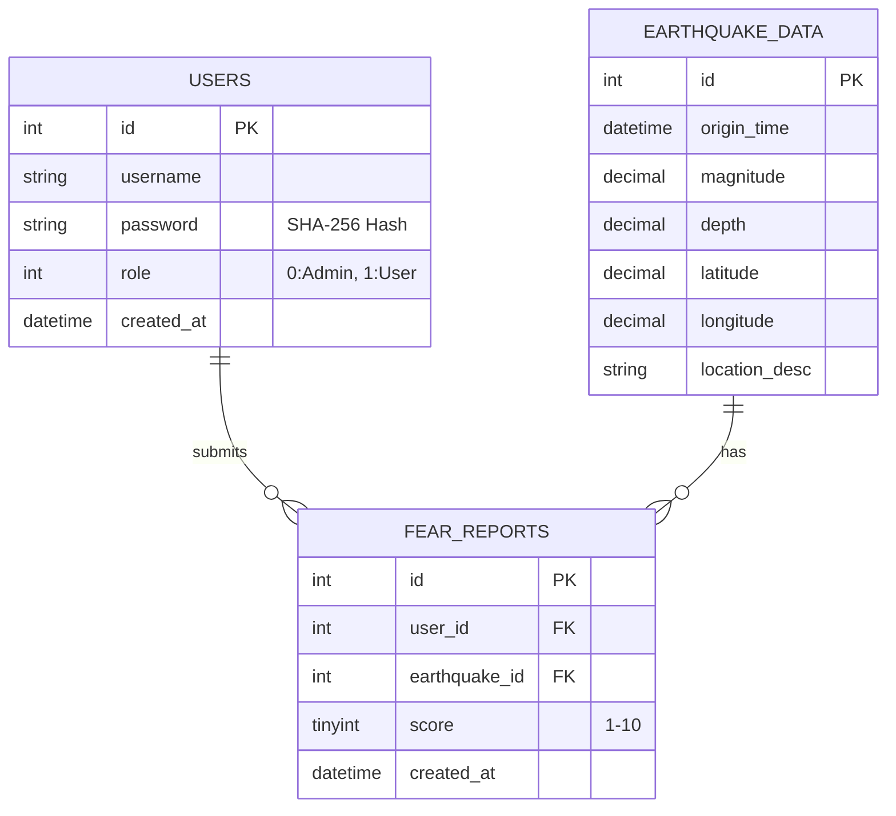

# 🌏 台灣小區域地震觀測網 (Taiwan Earthquake Observation System)

這是一個基於 **PHP** 與 **MySQL** 開發的即時地震資訊視覺化平台。透過串接中央氣象署 (CWA) 的 Open Data API，系統能自動同步最新的地震數據，並結合 **Leaflet.js** 地圖技術與社群互動機制，提供使用者直觀且具備地質分析能力的觀測介面。

## ✨ 核心功能 (Features)

### 1. 🗺️ GIS 地理資訊視覺化

* **互動式地圖**：使用 Leaflet.js 繪製，支援縮放與平移。
* **多圖層切換**：
* 🔴 **地震圓點 (Markers)**：依據規模大小顯示不同顏色（規模 4.0 以上顯示紅色警戒）。
* ♨️ **熱力圖 (Heatmap)**：視覺化呈現地震頻發區域。
* 🌊 **板塊邊界**：繪製菲律賓海板塊與歐亞大陸板塊交界（花東縱谷線）。
* ⚠️ **活動斷層**：內建台灣主要活動斷層路徑（如車籠埔、米崙斷層等）。
* **沉浸式定位**：點擊列表卡片，地圖自動平滑飛行 (FlyTo) 至震央並彈出詳細資訊。

### 2. 📊 數據分析儀表板

* **趨勢圖表**：整合 Chart.js 繪製「近 7 日地震頻率」長條圖。
* **規模分佈**：甜甜圈圖分析小區域 (<3)、顯著 (3-4) 與強震 (>4) 的比例 。
* **即時篩選**：前端即時過濾功能，可篩選「規模 3.0 / 4.0 / 5.0 以上」的地震資訊 。

### 3. 👥 社群互動與災情回報 (Crowdsourcing)

* **可怕程度評分**：登入會員可針對特定地震進行 1~10 分的主觀恐懼評分 。
* **即時統計**：系統自動計算每起地震的「平均恐懼分數」與「總回報人數」，量化民眾真實感受 。
### 4. 🔐 會員與權限管理

* **資安防護**：密碼採用 SHA-256 加密儲存，並使用 PDO 預處理防止 SQL Injection 。
* **權限分級 (RBAC)** ：
* **一般使用者 (Role 1)**：瀏覽資訊、篩選數據、提交回報。
* **管理員 (Role 0)**：擁有執行資料同步 API (`eq_sync.php`) 的權限。


### 5. 🎨 沉浸式 UI 設計

* **深色模式 (Dark Mode)**：適合長時間監控的深色介面。
**動態背景**：全螢幕影片背景 (`light.mp4`)，提升視覺體驗 。


---

## 🛠️ 技術堆疊 (Tech Stack)

* **Backend**: PHP (Native, No Framework)
* **Database**: MySQL / MariaDB (InnoDB Engine)
* **Frontend**: HTML5, CSS3, JavaScript (ES6)
* **Libraries**:
* [Leaflet.js](https://leafletjs.com/) (Map)
* [Leaflet.heat](https://github.com/Leaflet/Leaflet.heat) (Heatmap visualization)
* [Chart.js](https://www.chartjs.org/) (Data Visualization)


* **Data Source**: [中央氣象署 Open Data API (E-A0016-001)](https://opendata.cwa.gov.tw/) 


---

## 💾 資料庫架構 (Database Schema)

本專案包含三張主要資料表：使用者、地震數據、恐懼回報。



*[引用來源: 5, 6, 7]*

---

## 🚀 安裝與執行 (Installation)

### 1. 環境需求

* PHP 7.4 或更高版本 (需開啟 cURL 與 PDO 擴充)
* MySQL 5.7 或 MariaDB
* Apache / Nginx Web Server

### 2. 資料庫設定

請在 MySQL 中建立資料庫 `earthquake_system` 並匯入以下 SQL：

```sql
CREATE DATABASE earthquake_system CHARACTER SET utf8mb4 COLLATE utf8mb4_unicode_ci;
USE earthquake_system;

-- 地震資料表
CREATE TABLE earthquake_data (
    id INT AUTO_INCREMENT PRIMARY KEY,
    origin_time DATETIME NOT NULL,
    longitude FLOAT, latitude FLOAT, depth FLOAT, magnitude FLOAT,
    location_desc TEXT,
    created_at TIMESTAMP DEFAULT CURRENT_TIMESTAMP,
    UNIQUE KEY unique_eq (origin_time, longitude, latitude)
);

-- 使用者資料表
CREATE TABLE users (
    id INT AUTO_INCREMENT PRIMARY KEY,
    username VARCHAR(50) NOT NULL UNIQUE,
    password VARCHAR(255) NOT NULL,
    role TINYINT DEFAULT 1,
    created_at TIMESTAMP DEFAULT CURRENT_TIMESTAMP
);

-- 恐懼回報資料表
CREATE TABLE fear_reports (
    id INT AUTO_INCREMENT PRIMARY KEY,
    user_id INT NOT NULL,
    earthquake_id INT NOT NULL,
    score TINYINT NOT NULL CHECK (score BETWEEN 1 AND 10),
    created_at TIMESTAMP DEFAULT CURRENT_TIMESTAMP,
    UNIQUE KEY unique_report (user_id, earthquake_id),
    FOREIGN KEY (user_id) REFERENCES users(id),
    FOREIGN KEY (earthquake_id) REFERENCES earthquake_data(id)
);

```

### 3. 專案設定

1. 將專案複製到 Web Server 根目錄 (如 `htdocs` 或 `www`)。
2. 修改 `db.php` 設定資料庫連線：
```php
$host = 'localhost';
$db   = 'earthquake_system';
$user = 'root'; // 您的資料庫帳號
$pass = '';     // 您的資料庫密碼

```


3. 確保 `video/` 資料夾內有背景影片檔 (`light.mp4`) 。


### 4. 資料同步

1. 註冊一個新帳號，並在資料庫將其 `role` 修改為 `0` (管理員) 。


2. 登入後，點擊首頁上方的 **「📡 同步最新資料」** 按鈕，系統將從氣象署 API 抓取最新地震資訊。

---

## 📸 畫面截圖 (Screenshots)

*(建議在此處上傳您的系統截圖，例如首頁儀表板、地圖熱力圖模式、手機版畫面等)*

---

## 📄 授權 (License)

本專案為學術研究與教育用途。
資料來源：中央氣象署 (CWA) 開放資料平台。


